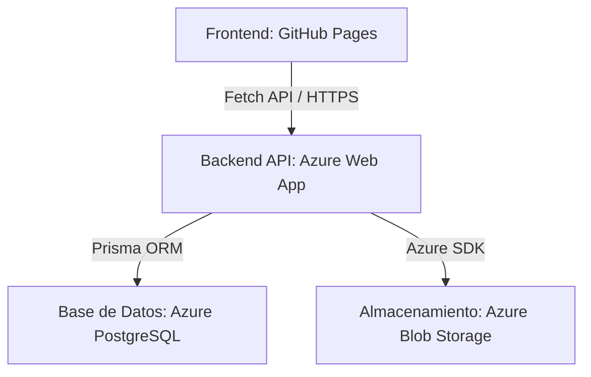

# Arquitectura de Software e Infraestructura en la Nube

El sistema adopta una **Arquitectura Desacoplada (Monorepo)**, optimizando los recursos de cómputo y almacenamiento mediante servicios gestionados en **Microsoft Azure**.

